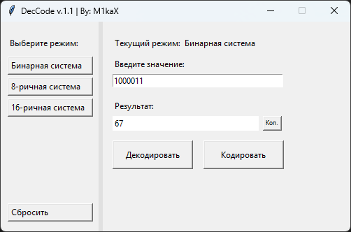

# DecCode
Небольшое приложение для Windows урощающая работу с системами исчислений. Простой и быстрый способ перевести числа и скопировать результат  

Возможности:  
• Копировать результат  
• Декодировать значение  
• Закодировать значение  
• Выбор между видами кодировки
